<h1 align="center">👋 Hi, I'm Gustavo Lima Dias</h1>

💻 Software Engineering Student | Backend Developer

---

🎓 Software Engineering — PUC Minas
📍 Brazil

---

  

<table>
  <tr>
    <td valign="top"></td>
    <td valign="top"></td>
  </tr>
</table>

---

## 🧠 About Me

I am a Software Engineering student at PUC Minas and and I've worked as an intern at Vallourec, focused on technology solutions in industrial environments.

I have hands-on experience with:
- Industrial tracking systems  
- API and endpoint integration  
- Driver configuration and system support  
- Industrial pipe marking systems (international integration)

Additionally, I have knowledge in backend development, APIs, databases, and software engineering best practices.

I am recognized for fast learning, adaptability, teamwork, and problem-solving.

---

## 🎓 Education
- 🎓 Software Engineering — PUC Minas (ongoing)

---

## 📬 Contact

  
  
  

---

## 🚀 Tech Stack

  

---

## 🛠️ Technical Skills
- 💻 Languages: C, C++, C#, Java, Python, JavaScript  
- 🌐 Web: HTML, CSS  
- ⚙️ Backend: APIs, FastAPI, system integration  
- 🗄️ Databases: MySQL, PostgreSQL  
- 🔄 Tools: Git, GitHub, GitLab, Postman  
- ☁️ Cloud: AWS (basic)  
- 🧠 Concepts:  
  - Computer Architecture  
  - Process Modeling (BPM/BPMN)  
  - Agile Methodologies  
  - System Design  

---

## 🔥 GitHub Streak

---

## 📈 Profile Activity

---

## 💡 Quote
💡 "Continuously evolving as a developer and turning knowledge into real-world solutions."
